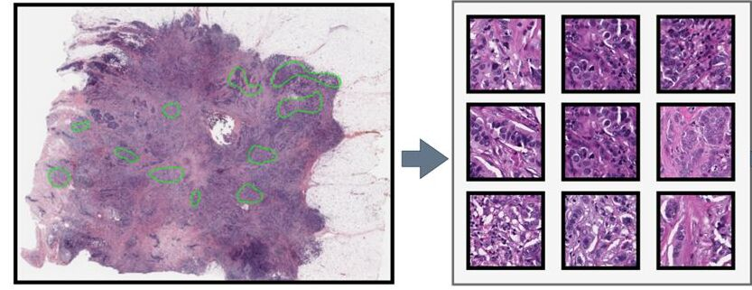

# Deep Learning Predicts Subtype Heterogeneity and Outcomes in Luminal A Breast Cancer Using Routinely Stained Whole Slide Images

This repository contains the necessary scripts and code used for testing the deep learning (DL) model with histology image patches extracted from annotated svs files. Below is a detailed description of each script and its purpose, along with instructions on how to run the code and train/test the model.

If this code needs to be run, all required Python pip packages are listed in the file `./codes/requirements.txt` and can be installed using:

```bash
pip install -r ./codes/requirements.txt
```
## Running the Code

To test the model on non-Luminal A data, use the following command:

```bash
python3 test_script.py -t nluma
```

To test the model on Luminal A images, run:

```bash
python3 test_script.py -t luma
```

## Scripts Overview

### 1. Loading SVS Slides and XML Annotations

The SVS slides and their corresponding XML annotations are located in the following directory:

```plaintext
./data/svs_and_xml/
```

Using these SVS and XML files, image patches are extracted from annotated regions.




### 2. Running the Scripts

To execute any script in your Python environment, simply run the script as shown below:

```bash
python Patch_mask_extractor.py
```

### 3. Patch Mask Extraction

**Patch_mask_extractor.py**

This script generates binary masks from XML annotations for SVS files. These binary masks are then used to extract image patches for training and testing.

```bash
python Patch_mask_extractor.py
```

### 4. Annotated Sub-Patch Extraction

**annotatations_to_subpatches_final.py**

This script extracts patches from annotated regions using the masks generated in the previous step.

```bash
python annotatations_to_subpatches_final.py
```

### Data Storage Structure

All extracted data will be stored in the following directories:

- `./data/TrainData` (Training data)
- `./data/ValData` (Validation data)
- `./data/TestData` (Test data)

### 5. Model Training

To train the model, run the following script:

```bash
python3 TrainVal.py
```

This will train the KimiaNet model using the extracted image patches.

### 6. Model Saving

Once the model has been trained, the final saved model can be found in the directory:

```plaintext
./data/SavedModel/
```

## Testing the Code

To test the model, use the following command:

```bash
python3 test_script.py
```

## Utility Scripts Overview

### Loss Function

**rce_loss.py**

This file implements the SSGCE loss used during the training process. It helps in optimizing the model performance during training.

### Data Loaders

**dataset_sampling2.py**

This file provides the necessary data loaders for training, validation, and testing, as well as for loss calculations. It handles the input/output of the data during different phases of model development.

### Data Augmentation

**myTransforms.py**

Custom data augmentations specific to histology images are defined in this file. These augmentations help in improving the model's robustness and generalization during training.

## Validation Analysis

### 1. Best Model Selection

**ValAnalysis.py**

This script selects the best model based on validation of matching the best correlation with ssNMF based purity criterion (pLumA), which is then used for testing on held-out data.

```bash
python ValAnalysis.py
```

### 2. Validation Results Printing

**ValPrint.py**

This file prints the validation results after evaluating the model on the validation set.

```bash
python ValPrint.py
```

### 3. Configuration Loader

**configure.py**

This script loads the configuration required for training the model from the following configuration file:

```plaintext
./code/config.yaml
```

The configuration file contains the necessary hyperparameters and settings for training the model.

---

Feel free to explore the repository and modify the scripts as needed to fit your dataset and problem setting.
